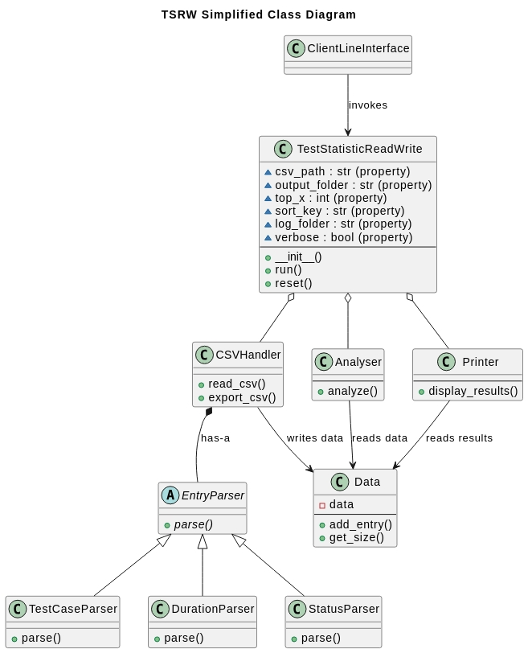

# Software Requirements Specification (SRS)

## Introduction

This Software Requirements Specification (SRS) document outlines the functional and non-functional requirements for the **TestStatisticReadWrite** tool. The document maps client requirements to developer requirements and details the corresponding tests to ensure comprehensive coverage and validation.

## Client Requirements Extracted from PDF

### 1. Functional Requirements (C-FR)

1. **C-FR1:** Process a CSV file containing test case information.

2. **C-FR2:** Read specific columns from the input CSV:
   - Test case, in format `<requirement>\<test case name>`
   - Duration, e.g., "5.4 sec", "2 min 48 sec" (time format)
   - Status, e.g., Passed, Failed

3. **C-FR3:** Accept input arguments for CSV paths and the number of test cases `<X>`:
   - Path to given CSV
   - Path to folder containing the new CSV
   - Number of test cases `<X>`

4. **C-FR4:** Print test case statistics and details to the command window:
   - Number of test cases
   - Number of passed, failed, etc., test cases
   - Test case names and their runtime of the top `<X>` most long-lasting test cases
   - Total runtime

5. **C-FR5:** Write a new CSV file with the following columns sorted by runtime:
   - Requirement
   - Test case name
   - Status
   - Runtime (in seconds, plain number with no time format)

6. **C-FR6:** Convert runtime from time format to seconds in the new CSV file.

### 2. Non-Functional Requirements (C-NFR)

1. **C-NFR1:** Implement the class TestStatisticReadWrite in a way that it can be delivered to a real customer.

Each client requirement **C-X** is mapped to a corresponding developer requirement **D-Y**, ensuring that the client requirement is expressed in a manner that is both measurable and testable, facilitating effective development and validation. A client requirement is considered **"Complete"** if all the corresponding developer requirements are marked as **"Complete."** The developer requirements are detailed in the following tables. Otherwise, the requirement is marked as **"In Progress."**

## Mapping of Client Requirements to Developer Requirements

| Client Requirement | Requirement Description | Developer Requirement | Status |
|---|---|---|---|
| C-FR1 | Process a CSV file containing test case information. | D-1, D-2, D-3, D-4, D-5, D-6, D-7, D-8, D-9 | Complete |
| C-FR2 | Read specific columns from the input CSV: - Test case, in format `<requirement>\<test case name>` - Duration, e.g., "5.4 sec", "2 min 48 sec" (time format) - Status, e.g., Passed, Failed | D-3, D-5, D-6, D-7 | Complete |
| C-FR3 | Accept input arguments for CSV paths and the number of test cases `<X>`: - Path to given CSV - Path to folder containing the new CSV - Number of test cases `<X>` | D-10, D-11, D-12 | Complete |
| C-FR4 | Print test case statistics and details to the command window: - Number of test cases - Number of passed, failed, etc., test cases - Test case names and their runtime of the top `<X>` most long-lasting test cases - Total runtime | D-13, D-14, D-15, D-16, D-17, D-18 | Complete |
| C-FR5 | Write a new CSV file with the following columns sorted by runtime: - Requirement - Test case name - Status - Runtime (in seconds, plain number with no time format) | D-4, D-8, D-19, D-20 | Complete |
| C-FR6 | Convert runtime from time format to seconds in the new CSV file. | D-6, D-19 | Complete |
| C-NFR1 | Implement the class TestStatisticReadWrite in a way that it can be delivered to a real customer. | D-21, D-22, D-23, D-24, D-25, D-26, D-27 | Complete |

## Developer Requirements

| Developer Requirement | Description |
|---|---|
| D-1 | The program must be able to read data from a CSV file. |
| D-2 | It must be verified that the specified CSV file exists. |
| D-3 | The header of the CSV file must be validated to ensure it matches expected format and structure. |
| D-4 | Parsed data from the CSV must be stored in a structured format for further processing. |
| D-5 | Test case name and requirement must be extracted from the corresponding column in the CSV file. |
| D-6 | Durations provided in the CSV must be converted from various time formats into seconds. |
| D-7 | Test status information must be extracted from the CSV and validated. |
| D-8 | The program must handle and log any lines in the CSV that do not conform to the expected format. |
| D-9 | Valid entries must be stored in a structured format, with sorted indexes for key fields ("Requirement", "Test Case", "Duration", and "Status"), and invalid lines must be tracked. |
| D-10 | The program must accept the path to the input CSV file as an argument. |
| D-11 | The program must accept the path to the output folder as an argument. |
| D-12 | The program must accept the number of top test cases (`<X>`) to process as an argument, with a default value of 10. |
| D-13 | The total runtime of all test cases must be calculated. |
| D-14 | The program must identify and sort the top `<X>` longest-running test cases. |
| D-15 | The total number of test cases must be calculated and displayed. |
| D-16 | The number of test cases for each status (e.g., Passed, Failed) must be counted. |
| D-17 | The program must display the count of test cases for each status (e.g., Passed, Failed). |
| D-18 | The names and runtimes of the top `<X>` longest-running test cases must be displayed. |
| D-19 | A new CSV file must be created with the columns "Requirement", "Test Case", "Status", and "Runtime" (in seconds). |
| D-20 | The new CSV file must be sorted by the "Duration" column in ascending order, or another specified key. |
| D-21 | The program must be fully covered by comprehensive tests. |
| D-22 | Errors and exceptions must be handled gracefully, with informative error messages provided to the user. |
| D-23 | Errors, warnings, and informational messages must be logged. |
| D-24 | Logs must have an option to be written to a file. |
| D-25 | Logging must be implemented using a Singleton design pattern. |
| D-26 | Logs must support a verbose mode, outputting messages to the console. |
| D-27 | The results must be displayed in either a formatted or plain-text view, as per user preference. |

## Mapping of Developer Requirements to Corresponding Tests

The diagram below provides a simplified and reduced overview of the developed system. 

The class **TestStatisticReadWrite** can be invoked either directly in developer mode or through a command-line interface. **TestStatisticReadWrite** serves as an orchestrator, delegating responsibilities to various modules and enabling a modular and extensible design.

Data parsing operations are managed by the **EntryParser** classes. The **CSVHandler** utilizes these parsers to read the provided CSV file and stores the processed data in a **Data** object. Once the data is stored, the orchestrator passes it to the **Analyzer**, which performs statistical analysis, calculates counts, and more. After the analysis is complete, the results are displayed by the **Printer**.

Detailed information and class diagrams can be found in the `docs` directory of the project repository.

This architecture allows the developer requirements to be reformulated with a greater focus on implementation details. The table below presents the developer requirements framed within the context of the chosen architecture. A developer requirement is considered **"Complete"** if all the corresponding tests have a status of **"Pass."** Otherwise, the requirement status is **"In Progress."** The corresponding tests are detailed in the following table.

| Developer Requirement | Description | Tests | Status |
|---|---|---|---|
| D-1 | The CSVHandler class shall be able to read data from a CSV file. |D-T-CSV-RDC-001, D-T-CSV-RDC-002, D-T-CSV-RDC-003, D-T-CSV-RDC-004, D-T-CSV-RDC-005, D-T-CSV-RDC-006, D-T-CSV-RDC-007, D-T-CSV-RDC-008, D-T-CSV-RDC-009, D-T-CSV-RDC-010, D-T-CSV-RDC-011  | Complete |
| D-2 | The CSVHandler class shall raise an InputFileNotFound exception if the specified CSV file does not exist. |D-T-CSV-RDC-002  | Complete |
| D-3 | The CSVHandler class shall validate the header of the CSV file: |D-T-CSV-RDC-001, D-T-CSV-RDC-004, D-T-CSV-RDC-005, D-T-CSV-RDC-006, D-T-CSV-RDC-007, D-T-CSV-RDC-008, D-T-CSV-RDC-009, D-T-CSV-RDC-010, D-T-CSV-RDC-011  | Complete |
| D-4 | The CSVHandler class shall store the parsed data in a Data object. |D-T-CSV-RDC-001, D-T-CSV-RDC-008, D-T-CSV-RDC-009, D-T-CSV-RDC-010, D-T-CSV-RDC-011, D-T-DAT-AEW-001, D-T-DAT-AME-001, D-T-DAT-ASE-001  | Complete |
| D-5 | The TestCaseParser class shall parse the "Test case" column, extracting the requirement and test case name. |D-T-PAR-TCE-001, D-T-PAR-TCI-001, D-T-PAR-TCV-001, D-T-PAR-TCV-002  | Complete |
| D-6 | The DurationParser class shall parse the "Duration" column, converting the time format into seconds. |D-T-PAR-DPV-001, D-T-PAR-DPV-002  | Complete |
| D-7 | The StatusParser class shall parse the "Status" column. |D-T-PAR-SPE-001, D-T-PAR-SPS-001, D-T-PAR-SPV-001  | Complete |
| D-8 | The CSVHandler class shall skip and log lines that do not conform to the expected format: |D-T-CSV-LRV-001  | Complete |
| D-9 | The Data class shall store valid entries, maintain sorted indexes for each field ("Requirement", "Test Case", "Duration", and "Status"), and track invalid lines. |D-T-DAT-AEW-001, D-T-DAT-AME-001, D-T-DAT-ASE-001, D-T-PAR-DPV-001, D-T-PAR-DPV-002, D-T-PAR-SPE-001, D-T-PAR-SPS-001, D-T-PAR-SPV-001, D-T-PAR-TCE-001, D-T-PAR-TCI-001, D-T-PAR-TCV-001, D-T-PAR-TCV-002  | Complete |
| D-10 | The TestStatisticReadWrite class shall accept the path to the input CSV file as an argument. |D-T-CLI-ARG-001, D-T-CLI-CSK-001  | Complete |
| D-11 | The TestStatisticReadWrite class shall accept the path to the output folder as an argument. |D-T-ORC-OFC-001  | Complete |
| D-12 | The TestStatisticReadWrite class shall accept the number of top test cases (`<X>`) as an argument (defaulting to 10). |D-T-CLI-ACX-001, D-T-CLI-DEX-001, D-T-CLI-IXA-001,  D-T-CLI-IXN-001  | Complete |
| D-13 | The Analyser class shall calculate the total runtime of all test cases. |D-T-AN-AN-001, D-T-AN-GDU-001  | Complete |
| D-14 | The Analyser class shall determine the top `<X>` longest-running test cases. |D-T-AN-AN-001, D-T-AN-GTX-001, D-T-AN-GTX-002, D-T-AN-GTX-003, D-T-AN-GTX-004  | Complete |
| D-15 | The Printer class shall print the total number of test cases. |D-T-PRI-DRF-001, D-T-PRI-DRN-001, D-T-PRI-DRN-002  | Complete |
| D-16 | The Data class shall count the number of test cases for each status. |D-T-DAT-CSC-001  | Complete |
| D-17 | The Printer class shall print the number of test cases for each status (Passed, Failed, etc.). |D-T-PRI-DRF-001, D-T-PRI-DRN-001, D-T-PRI-DRN-002  | Complete |
| D-18 | The Printer class shall print the test case names and runtimes of the top `<X>` longest-running test cases. |D-T-PRI-DRF-001, D-T-PRI-DRN-001, D-T-PRI-DRN-002, D-T-PRI-GWD-001, D-T-PRI-GWE-001, D-T-PRI-GWL-001  | Complete |
| D-19 | The CSVHandler class shall write a new CSV file with the columns "Requirement", "Test Case", "Status", and "Runtime" (in seconds). |D-T-CSV-EXC-001, D-T-CSV-EXC-003  | Complete |
| D-20 | The CSVHandler class shall sort the output CSV file by the "Duration" column in ascending order or by another key. |D-T-CLI-CSK-001, D-T-CSV-EXC-001, D-T-CSV-EXC-003  | Complete |
| D-21 | The TestStatisticReadWrite shall have comprehensive test coverage. | All tests with the "D-T-" prefix.  | Complete |
| D-22 | The TestStatisticReadWrite class shall handle exceptions gracefully and provide informative error messages to the user. |D-T-CLI-FRE-001,   D-T-CLI-IXA-001, D-T-CLI-IXN-001, D-T-CLI-UEX-002, D-T-CSV-EXC-003, D-T-CSV-RDC-002, D-T-CSV-RDC-003, D-T-CSV-RDC-004, D-T-CSV-RDC-005, D-T-CSV-RDC-006, D-T-CSV-RDC-007, D-T-ORC-LFC-001, D-T-ORC-OFC-001, D-T-ORC-RFE-001, D-T-ORC-RFE-002, D-T-ORC-RUE-001| Complete |
| D-23 | The Logger class shall log errors, warnings, and informational messages. |D-T-CLI-LES-001, D-T-CSV-LRV-001, D-T-LOG-EMS-001, D-T-LOG-ERR-001, D-T-LOG-INF-001, D-T-LOG-SLF-001, D-T-LOG-SLU-001, D-T-LOG-SPC-001, D-T-LOG-SVD-001, D-T-LOG-SVE-001, D-T-LOG-WAR-001, D-T-ORC-RUE-001  | Complete |
| D-24 | The Logger class shall have option to write logs to a file. |D-T-CLI-FRE-001, D-T-CLI-SSV-001, D-T-LOG-SLF-001, D-T-LOG-SLU-001, D-T-ORC-LFC-001  | Complete |
| D-25 | The Logger class shall be a Singleton. |D-T-LOG-SIN-001  | Complete |
| D-26 | The Logger class shall have option to enable verbose mode, which outputs logs to the console. |D-T-CLI-SSN-001, D-T-CLI-SSV-001, D-T-LOG-SVD-001, D-T-LOG-SVE-001  | Complete |
| D-27 | The Printer shall have an option to display the results in formatted or plain text way. |D-T-PRI-DAO-001, D-T-PRI-DBO-001  | Complete |

## Test Cases Matrix

The Test Cases Matrix contains brief descriptions of the tests. Detailed test specifications and implementations can be found in the `"docs/test_specs"` directory of the project repository. A detailed description of the Test ID structure can be found in the Appendix.

| Test ID            | Description                                                                                                 | Status |
|--------------------|-------------------------------------------------------------------------------------------------------------|--------|
| D-T-AN-AN-001      | Assess the overall analysis functionality to ensure accurate calculations and selections.                  | Pass   |
| D-T-AN-AN-002      | Ensure the analysis method appropriately handles invalid input values.                                      | Pass   |
| D-T-AN-GDU-001     | Verify that the total duration of all test cases is calculated correctly.                                   | Pass   |
| D-T-AN-GTX-001     | Check if the program accurately retrieves the top X longest-running tests.                                 | Pass   |
| D-T-AN-GTX-002     | Confirm that requesting top X tests from an empty dataset returns an empty list.                            | Pass   |
| D-T-AN-GTX-003     | Ensure that requesting more tests than available returns all tests sorted by duration.                      | Pass   |
| D-T-AN-GTX-004     | Validate that requesting zero top tests results in an empty list.                                          | Pass   |

| Test ID            | Description                                                                                                 | Status |
|--------------------|-------------------------------------------------------------------------------------------------------------|--------|
| D-T-CLI-ACX-001    | Verify that the CLI correctly handles and uses a custom <X> value.                                            | Pass   |
| D-T-CLI-ARG-001    | Ensure that the CLI handles missing required command-line arguments properly.                               | Pass   |
| D-T-CLI-CSK-001    | Verify that a custom sort key provided via the command line is handled correctly.                           | Pass   |
| D-T-CLI-DEX-001    | Verify that the CLI correctly defaults the <X> value to 10.                                                | Pass   |
| D-T-CLI-FRE-001    | Ensure that user-friendly exceptions are handled correctly in the CLI.                                     | Pass   |
| D-T-CLI-IXA-001    | Verify that the CLI handles invalid non-integer values for <X>.                                           | Pass   |
| D-T-CLI-IXN-001    | Verify that the CLI handles negative integer values for <X>.                                                 | Pass   |
| D-T-CLI-LES-001    | Confirm that the end of session is properly logged by the CLI.                                             | Pass   |
| D-T-CLI-SSN-001    | Verify successful execution of the CLI with valid input without verbose logging.                           | Pass   |
| D-T-CLI-SSV-001    | Verify successful execution with verbose logging enabled and a specified log folder.                        | Pass   |
| D-T-CLI-UEX-002    | Ensure that unexpected exceptions during CLI execution are handled appropriately.                           | Pass   |

| Test ID            | Description                                                                                                 | Status |
|--------------------|-------------------------------------------------------------------------------------------------------------|--------|
| D-T-CSV-EXC-001    | Test exporting data to a CSV file with valid data and sorting.                                             | Pass   |
| D-T-CSV-EXC-003    | Verify that a CSVExportError is raised when a file write error occurs during CSV export.                   | Pass   |
| D-T-CSV-LRV-001     | Ensure that skipped lines due to errors are correctly logged and reported.                                 | Pass   |
| D-T-CSV-RDC-001     | Confirm the program can successfully read and parse data from a valid CSV file.                            | Pass   |
| D-T-CSV-RDC-002     | Ensure that an InputFileNotFound exception is raised when attempting to read a non-existent file.           | Pass   |
| D-T-CSV-RDC-003     | Verify that an EmptyFileError is raised when reading an empty CSV file.                                   | Pass   |
| D-T-CSV-RDC-004     | Confirm that an InvalidHeaderColumns exception is raised for a CSV file with incorrect header columns.     | Pass   |
| D-T-CSV-RDC-005     | Ensure that an InvalidHeaderFormat exception is raised for a CSV file with an incorrect header format.      | Pass   |
| D-T-CSV-RDC-006     | Verify that a NoDataLinesError is raised when a CSV file contains only a header and no data lines.          | Pass   |
| D-T-CSV-RDC-007     | Confirm that a NoValidLinesError is raised when all data lines in a CSV file are invalid.                   | Pass   |
| D-T-CSV-RDC-008     | Ensure that lines with an incorrect number of columns are skipped and logged.                              | Pass   |
| D-T-CSV-RDC-009     | Verify that lines with empty fields are skipped and logged appropriately.                                 | Pass   |
| D-T-CSV-RDC-010     | Confirm that lines with parsing errors are skipped and logged correctly.                                   | Pass   |
| D-T-CSV-RDC-011     | Ensure that lines are skipped and logged if the status parser returns None.                                | Pass   |

| Test ID            | Description                                                                                                 | Status |
|--------------------|-------------------------------------------------------------------------------------------------------------|--------|
| D-T-DAT-AEW-001     | Ensure that adding entries with identical values is handled correctly by the Data object.                   | Pass   |
| D-T-DAT-AME-001     | Verify that adding multiple entries maintains proper sorting within the Data object.                       | Pass   |
| D-T-DAT-ASE-001     | Test adding a single entry to the Data object and ensure related lists and values are updated correctly.    | Pass   |
| D-T-DAT-CSC-001     | Verify that a new Data object correctly maintains a collection of test IDs for each status.                 | Pass   |
| D-T-DAT-INI-001     | Verify that a new Data object initializes with empty lists and dictionaries.                               | Pass   |

| Test ID            | Description                                                                                                 | Status |
|--------------------|-------------------------------------------------------------------------------------------------------------|--------|
| D-T-LOG-EMS-001     | Test logging of empty strings to ensure the Logger handles them gracefully.                              | Pass   |
| D-T-LOG-ERR-001     | Ensure that error messages are logged appropriately at the ERROR level.                                  | Pass   |
| D-T-LOG-INF-001     | Verify that informational messages are logged correctly at the INFO level.                                | Pass   |
| D-T-LOG-SIN-001     | Confirm that the Logger class adheres to the singleton pattern.                                           | Pass   |
| D-T-LOG-SLF-001     | Test setting the log folder to ensure logs are directed to the specified location.                        | Pass   |
| D-T-LOG-SLU-001     | Verify that resetting the log folder removes and closes existing log file handlers properly.              | Pass   |
| D-T-LOG-SPC-001     | Verify that messages containing special characters are logged without issues.                             | Pass   |
| D-T-LOG-SVD-001     | Confirm that disabling verbose logging works correctly.                                                   | Pass   |
| D-T-LOG-SVE-001     | Ensure that enabling verbose logging functions as expected.                                              | Pass   |
| D-T-LOG-WAR-001     | Confirm that warning messages are logged correctly at the WARNING level.                                 | Pass   |

| Test ID            | Description                                                                                                 | Status |
|--------------------|-------------------------------------------------------------------------------------------------------------|--------|
| D-T-ORC-LFC-001    | Confirm that an OutputFolderError is raised when the program fails to create the log folder.                 | Pass   |
| D-T-ORC-OFC-001    | Ensure that an OutputFolderError is raised when the program cannot create the output folder.                | Pass   |
| D-T-ORC-RFE-001     | Ensure that FriendlyException during data reading is handled by logging the error and exiting gracefully.  | Pass   |
| D-T-ORC-RFE-002     | Verify that FriendlyException during data export is handled by logging the error and exiting gracefully.  | Pass   |
| D-T-ORC-RUE-001     | Confirm that unexpected exceptions are not handled internally and are allowed to propagate as intended.    | Pass   |
| D-T-ORC-SSK-001     | Test that the sort key can be successfully updated using the set_sort_key method.                           | Pass   |

| Test ID            | Description                                                                                                 | Status |
|--------------------|-------------------------------------------------------------------------------------------------------------|--------|
| D-T-PAR-DPV-001     | Test various valid and invalid duration strings to ensure correct parsing by the DurationParser.           | Pass   |
| D-T-PAR-DPV-002     | Confirm that invalid numeric values in duration strings are handled gracefully by the DurationParser.      | Pass   |
| D-T-PAR-SPE-001     | Test that empty status strings are handled appropriately by the StatusParser.                              | Pass   |
| D-T-PAR-SPS-001     | Ensure that status strings with leading and trailing spaces are parsed accurately by the StatusParser.     | Pass   |
| D-T-PAR-SPV-001     | Verify that valid status strings are parsed correctly by the StatusParser.                                 | Pass   |
| D-T-PAR-TCE-001     | Ensure that test case strings with empty segments are handled correctly by the parser.                    | Pass   |
| D-T-PAR-TCI-001     | Verify that improperly formatted test case strings trigger appropriate error handling in the parser.       | Pass   |
| D-T-PAR-TCV-001     | Confirm that valid test case strings are parsed correctly by the TestCaseParser.                          | Pass   |
| D-T-PAR-TCV-002     | Ensure that test case strings with extra spaces are parsed accurately by the TestCaseParser.             | Pass   |

| Test ID            | Description                                                                                                 | Status |
|--------------------|-------------------------------------------------------------------------------------------------------------|--------|
| D-T-PRI-DAO-001     | Test the advanced output method to ensure it generates a well-structured table with headers and data rows. | Pass   |
| D-T-PRI-DBO-001     | Verify that the basic output method correctly formats and displays each entry's information line by line.  | Pass   |
| D-T-PRI-DRF-001     | Ensure that analysis results are displayed in a properly formatted table with correct alignment and separators. | Pass   |
| D-T-PRI-DRN-001     | Verify that the display results method correctly handles scenarios with no analysis results to show.        | Pass   |
| D-T-PRI-DRN-002     | Confirm that analysis results are displayed correctly without formatting when specified.                  | Pass   |
| D-T-PRI-GWD-001     | Ensure that table column widths are accurately calculated based on header and data lengths.                | Pass   |
| D-T-PRI-GWE-001     | Confirm that column widths are set correctly when there is no data, relying solely on header lengths.       | Pass   |
| D-T-PRI-GWL-001     | Verify that column widths adjust appropriately when data values exceed header lengths.                      | Pass   |

## Appendix 

### Test ID Structure

The Test ID naming convention follows the structure:

`[Source]-[Type]-[Module]-[Category]-[Sequential Number]`

#### Components of the Test ID

1. **Source**:
   - `C`: Client-facing (tests required by the client)
   - `D`: Developer-facing (internal tests, module-level tests, etc.)

2. **Type**:
   - `T`: Test

3. **Module**:
   - `AN`: Analyser module (e.g., `analyser.py`)
   - `CSV`: CSV Handler module (e.g., `csv_handler.py`)
   - etc.

4. **Category**:
   - Describes the specific function or focus of the test (e.g., validation, parsing, etc.).

5. **Sequential Number**:
   - A unique identifier within the scope of the source, type, module, and category.

#### Example
- `D-T-CSV-RDC-001`: A developer-facing test (`D`) for the CSV module (`CSV`), specifically focusing on reading CSV files (`RDC`), and is the first in its sequence (`001`).
- `C-T-AN-GDU-001`: A client-facing test (`C`) for the Analyser module (`AN`), focusing on calculating total duration (`GDU`), and is the first in its sequence (`001`).

## Glossary

| Term        | Definition                                                                                |
| :---------- | :---------------------------------------------------------------------------------------- |
| **CSV**     | Comma Separated Values. A file format used to store tabular data.                             |
| **SRS**     | Software Requirements Specification. A document that describes the intended purpose and environment for software under development. |
| **Singleton** | A design pattern that restricts the instantiation of a class to one object. |
| **Orchestrator** | A class that coordinates and manages the execution of other classes or modules in a system. |
